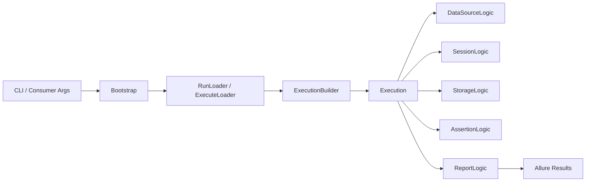

# QaaS.Runner

[](https://github.com/TheSmokeTeam/QaaS.Runner/actions/workflows/ci.yml)


QaaS.Runner is the execution orchestration layer for QaaS test workflows. It loads YAML-based test definitions, builds execution pipelines, runs sessions/assertions/storage flows, and writes rich reports (Allure).

Official documentation: [TheSmokeTeam QaaS Docs](https://thesmoketeam.github.io/qaas-docs/)

## Table of Contents

- [Solution Overview](#solution-overview)
- [NuGet Packages](#nuget-packages)
- [Architecture](#architecture)
- [Core Functionalities](#core-functionalities)
- [Getting Started](#getting-started)
- [Command Verbs](#command-verbs)
- [Testing and Coverage](#testing-and-coverage)
- [Project Structure](#project-structure)
- [Additional Links](#additional-links)

## Solution Overview

This repository contains one solution: `QaaS.Runner.sln`.

The solution is organized into:

- `QaaS.Runner`: top-level execution orchestration and command loading.
- `QaaS.Runner.Assertions`: assertion execution and report writing (Allure).
- `QaaS.Runner.Sessions`: staged session/actions runtime.
- `QaaS.Runner.Storage`: storage and retrieval of session data (FileSystem/S3).
- `QaaS.Runner.Infrastructure`: shared utility layer.
- `*.Tests` projects: NUnit test suites for each core area.

## NuGet Packages

> Badges use `shields.io` and NuGet endpoints.

| Package | Latest Version | Downloads | Notes |
| --- | --- | --- | --- |
| [`QaaS.Runner`](https://www.nuget.org/packages/QaaS.Runner/) | [](https://www.nuget.org/packages/QaaS.Runner/) | [](https://www.nuget.org/packages/QaaS.Runner/) | Published package |
| [`QaaS.Runner.Assertions`](https://www.nuget.org/packages?q=QaaS.Runner.Assertions) | [](https://www.nuget.org/packages?q=QaaS.Runner.Assertions) | [](https://www.nuget.org/packages?q=QaaS.Runner.Assertions) | Internal project in this solution |
| [`QaaS.Runner.Sessions`](https://www.nuget.org/packages?q=QaaS.Runner.Sessions) | [](https://www.nuget.org/packages?q=QaaS.Runner.Sessions) | [](https://www.nuget.org/packages?q=QaaS.Runner.Sessions) | Internal project in this solution |
| [`QaaS.Runner.Storage`](https://www.nuget.org/packages?q=QaaS.Runner.Storage) | [](https://www.nuget.org/packages?q=QaaS.Runner.Storage) | [](https://www.nuget.org/packages?q=QaaS.Runner.Storage) | Internal project in this solution |
| [`QaaS.Runner.Infrastructure`](https://www.nuget.org/packages?q=QaaS.Runner.Infrastructure) | [](https://www.nuget.org/packages?q=QaaS.Runner.Infrastructure) | [](https://www.nuget.org/packages?q=QaaS.Runner.Infrastructure) | Internal project in this solution |

## Architecture



Execution flow is selected by command verb:

- `run`: DataSources -> Sessions -> Assertions -> Reports
- `act`: DataSources -> Sessions -> Storage
- `assert`: DataSources -> Storage -> Assertions -> Reports
- `template`: Prints templated/expanded configuration
- `execute`: Runs a YAML list of commands sequentially

## Core Functionalities

### 1. Bootstrap and Runner Lifecycle

- Parses supported verbs with `CommandLineParser`.
- Maps each verb into corresponding loader.
- Builds one or more `ExecutionBuilder` instances.
- Runs setup/build/start/teardown lifecycle in `Runner`.
- Supports optional result cleanup and auto-serving Allure output.

### 2. Configuration Loading and Case Expansion

- Loads `.qaas.yaml` configuration.
- Supports overwrite files and overwrite arguments.
- Supports push-references and environment variable resolution.
- Supports running a single config or a set of case files.
- Supports case loading from filesystem or JFrog Artifactory URL.

### 3. Sessions Runtime

- Sessions are split into ordered stages.
- Stage actions run concurrently where applicable.
- Supports publishers, consumers, transactions, probes, and collectors.
- Tracks action failures and flakiness metadata.
- Produces `SessionData` payloads for assertions/storage.

### 4. Assertions and Reporting

- Builds assertions from configured hook names.
- Filters sessions/data sources by name or regex.
- Computes assertion status (`Passed`, `Failed`, `Broken`, etc.).
- Generates Allure test results with:
  - links (Grafana/Kibana/Prometheus builders),
  - session data attachments,
  - assertion attachments,
  - configuration template attachment,
  - optional coverage XML attachments.

### 5. Storage

- `FileSystemStorage`: stores/retrieves serialized session JSON files.
- `S3Storage`: stores/retrieves session JSON via S3-compatible APIs.
- Unified `StorageBuilder` ensures a single active storage type per builder.

### 6. Execute Orchestration

- `execute` command reads a YAML command list and runs them in order.
- Supports filtering by command IDs.
- Prevents recursive `execute` invocation from within execute command file.

## Getting Started

### Prerequisites

- .NET SDK 10.x
- Access to QaaS configuration files (`.qaas.yaml`, optional cases)
- Optional: Allure CLI for local result serving

### Install Package

```bash
dotnet add package QaaS.Runner
```

### Build and Test

```bash
dotnet restore QaaS.Runner.sln
dotnet build QaaS.Runner.sln --configuration Release
dotnet test QaaS.Runner.sln --configuration Release
```

## Command Verbs

```bash
# full run (sessions + assertions + reports)
qaas run ./test.qaas.yaml

# act only (produce and store session data)
qaas act ./test.qaas.yaml

# assert only (load session data and assert)
qaas assert ./test.qaas.yaml

# template effective config
qaas template ./test.qaas.yaml

# execute command list from executable yaml
qaas execute ./executable.yaml
```

Typical useful flags (see source options for complete list):

- `--with-files`: overlay configuration files
- `--overwrite-arguments`: inline key-path overrides
- `--push-references`: push reference fragments into list sections
- `--cases`: run across a cases directory or URL
- `--session-names` / `--assertion-names`: partial execution filters
- `--session-categories` / `--assertion-categories`: category filters

## Testing and Coverage

Coverage below was measured from local run:

- Command: `dotnet test QaaS.Runner.sln --collect:"XPlat Code Coverage" --results-directory TestResults`
- Date: `2026-03-06`
- Method: aggregated line coverage across all generated Cobertura reports

| Project | Coverage | Covered Lines | Total Lines |
| --- | --- | --- | --- |
| `QaaS.Runner` |  | 1036 | 1059 |
| `QaaS.Runner.Assertions` |  | 716 | 807 |
| `QaaS.Runner.Sessions` |  | 2151 | 2201 |
| `QaaS.Runner.Storage` |  | 124 | 152 |
| `QaaS.Runner.Infrastructure` |  | 32 | 54 |

## Project Structure

```text
QaaS.Runner.sln
|- QaaS.Runner
|- QaaS.Runner.Assertions
|- QaaS.Runner.Sessions
|- QaaS.Runner.Storage
|- QaaS.Runner.Infrastructure
|- QaaS.Runner.Tests
|- QaaS.Runner.Assertions.Tests
|- QaaS.Runner.Sessions.Tests
|- QaaS.Runner.Storage.Tests
|- QaaS.Runner.Infrastructure.Tests
|- QaaS.Runner.E2ETests
```

## Additional Links

- QaaS docs: [https://thesmoketeam.github.io/qaas-docs/](https://thesmoketeam.github.io/qaas-docs/)
- Repository: [QaaS.Runner Repository](.)
- CI workflow: [`.github/workflows/ci.yml`](.github/workflows/ci.yml)
